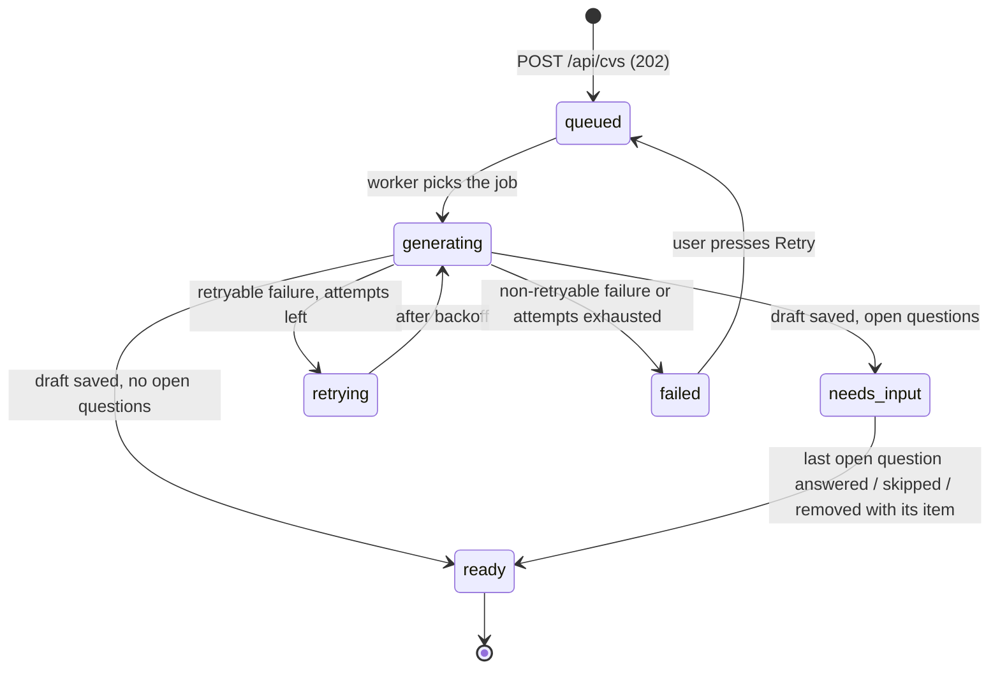

# CV statuses

> Status: **draft for review** — part of the design set
> [architecture.md](architecture.md) · [api.md](api.md) · cv-statuses.md (this file).

One list of statuses for backend and frontend. The backend is the only one that **computes** a
status; the frontend only **maps** the string to a label, a color, a set of actions and a polling
decision. The code below lives in `shared/src/cv-status.ts` and is imported by both apps, so they
cannot drift apart.

## 1. The six statuses



| status | meaning | data | extra fields |
|---|---|---|---|
| `queued` | Input saved, job waits for a worker | `null` | `queuePosition` |
| `generating` | DraftAgent is running | `null` | `stage`, `attempt` |
| `retrying` | An attempt failed with a retryable error; waits for backoff | `null` | `attempt`, `maxAttempts` |
| `failed` | Non-retryable error or all attempts used | `null` | `error` |
| `needs_input` | Draft saved, at least one question is `open` | `CvData` | `openQuestions` |
| `ready` | Draft saved, no open questions (all answered or skipped) | `CvData` | — |

A CV leaves the "no draft" side exactly once: the first successful attempt. After that the status
only moves `needs_input → ready`, and `ready` is final. Re-targeting a CV to another role is not a
transition — it creates a **new** CV (see [architecture.md §7](architecture.md#7-role-targeting--match)).

### Groups — what the frontend decides from a status

| group | statuses | polling | screen |
|---|---|---|---|
| **in progress** | `queued`, `generating`, `retrying` | on, every 3 s | progress card, no editor |
| **needs the user** | `failed` | off | error text + **Retry** |
| **has draft** | `needs_input`, `ready` | off | editor, preview, match, PDF (+ questions when `needs_input`) |

### Shared code

```ts
// shared/src/cv-status.ts
export const CV_STATUSES = [
  'queued', 'generating', 'retrying', 'failed', 'needs_input', 'ready',
] as const;
export type CvStatus = (typeof CV_STATUSES)[number];

export const CV_TRANSITIONS: Record<CvStatus, readonly CvStatus[]> = {
  queued:      ['generating'],
  generating:  ['needs_input', 'ready', 'retrying', 'failed'],
  retrying:    ['generating'],
  failed:      ['queued'],
  needs_input: ['ready'],
  ready:       [],
};

export const canTransition = (from: CvStatus, to: CvStatus) => CV_TRANSITIONS[from].includes(to);
export const isInProgress = (s: CvStatus) => s === 'queued' || s === 'generating' || s === 'retrying';
export const hasDraft     = (s: CvStatus) => s === 'needs_input' || s === 'ready';

export const GENERATION_STAGES = ['drafting', 'verifying', 'revising', 'saving'] as const;
export type GenerationStage = (typeof GENERATION_STAGES)[number];
```

## 2. Per status: backend, frontend, user actions

### `queued` — "In queue"
- **Backend:** `cvs` row + `generation_jobs` row written in one transaction, then the job id is
  added to BullMQ. `queuePosition` = number of `queued` CVs created earlier (all users) + 1 —
  only the number leaves the server.
- **Frontend:** neutral badge, "N ahead of you" (no time promises). Polls.
- **User can:** delete; close the tab — nothing is lost.

### `generating` — "Generating"
- **Backend:** worker sets `generating` + `attempt`, runs DraftAgent (see
  [architecture.md §6](architecture.md#6-generation-pipeline)) and updates `stage`:

  | stage | what happens | UI text |
  |---|---|---|
  | `drafting` | model writes the draft | "Writing your CV" |
  | `verifying` | facts checked against the source | "Checking facts against your source" |
  | `revising` | model fixes facts the verifier rejected (agent loop step 2–3) | "Fixing unconfirmed facts" |
  | `saving` | draft, questions, requirements written in one transaction | "Saving" |

- **Frontend:** accent badge, spinner + stage text. Polls. No editor yet.
- **User can:** delete.

### `retrying` — "Retrying"
- **Backend:** the attempt failed with a **retryable** error (Anthropic 429/5xx/overloaded,
  network, timeout, schema-invalid output after the agent's last step). BullMQ re-runs it after
  exponential backoff (5 s, 10 s). `attempt` is incremented when the next attempt starts.
- **Frontend:** warning badge, "Attempt 2 of 3 failed, retrying…". Polls.
- **User can:** delete. Nothing else is needed.

### `failed` — "Failed"
- **Backend:** reached when attempts are exhausted **or** the error is non-retryable (invalid API
  key, request rejected as invalid, input too large for the model). Stores `error_code` and a
  human-readable `error`. Source text and user facts stay, so Retry needs no re-upload.

  | error_code | user message |
  |---|---|
  | `LLM_UNAVAILABLE` | "The AI service is unavailable right now. Try again in a few minutes." |
  | `LLM_INVALID_OUTPUT` | "The AI returned an unusable draft several times. Try again." |
  | `LLM_CONFIG` | "The AI service is not configured on the server." (bad/missing key) |
  | `TIMEOUT` | "Generation took too long. Try again." |
  | `INTERNAL` | "Something went wrong on our side. Try again." (details only in logs) |

- **Frontend:** danger badge, error text, **Retry** and **Delete**. Polling stops.
- **User can:** retry (`POST /api/cvs/:id/retry` → `queued`, `attempt` resets to 1; counts toward
  the hourly limit), delete.

### `needs_input` — "Needs your answers"
- **Backend:** draft saved, open questions exist. Each answer/skip updates its field
  (see [architecture.md §6.5](architecture.md#65-questions--answers)); when the last open question
  is closed, the same transaction sets `ready`. A manual save that removes an item skips the
  questions about it, which can close the last one too.
- **Frontend:** warning badge with the open-question count; editor, questions panel, match panel,
  preview, Download PDF. No polling.
- **User can:** answer, pick an option, skip, edit any field, download PDF, create a CV for a
  suggested role, delete.

### `ready` — "Ready"
- **Backend:** draft saved, no open questions. PDF is rendered from current `data` on each download.
- **Frontend:** success badge; editor, match panel, preview, Download PDF. No questions panel.
- **User can:** edit, download PDF, create a CV for a suggested role, delete.

## 3. Allowed actions by status

The API enforces this table; anything else returns `409 INVALID_STATE`. Delete is always allowed.

| endpoint | queued | generating | retrying | failed | needs_input | ready |
|---|:-:|:-:|:-:|:-:|:-:|:-:|
| `GET /api/cvs/:id` | ✓ | ✓ | ✓ | ✓ | ✓ | ✓ |
| `DELETE /api/cvs/:id` | ✓ | ✓ | ✓ | ✓ | ✓ | ✓ |
| `POST /api/cvs/:id/retry` | | | | ✓ | | |
| `PATCH /api/cvs/:id` | | | | | ✓ | ✓ |
| `GET /api/cvs/:id/pdf` | | | | | ✓ | ✓ |
| `POST …/questions/:qid/answer`, `/skip` | | | | | ✓ | |
| `POST /api/cvs` with `fromCvId` (new CV, same source) | | | | | ✓ | ✓ |

## 4. How a status changes

- **One writer.** Only `CvStatusService` changes `cvs.status`. The worker, the answer endpoint
  and the manual save call it; it checks `canTransition` before writing.
- **Compare-and-set.** Every transition is
  `UPDATE cvs SET status = :to, … WHERE id = :id AND status = ANY(:allowedFrom)`.
  0 rows updated ⇒ someone else moved or deleted the CV ⇒ the caller drops its result. This makes
  BullMQ re-runs (stalled jobs) and a delete during generation safe without locks.
- **Draft + status in one transaction.** `data`, questions, requirements, `version + 1` and the
  status are written together; a crash in between leaves the CV in `generating`, which BullMQ's
  stalled-job check re-runs.
- **Recovery on worker start.** CVs in `queued`/`generating`/`retrying` without a live BullMQ job
  (e.g. Redis was wiped) are re-enqueued; `jobId` = job row id, so duplicates are ignored.

## 5. Related state machines

### Question (`cv_questions.status`)

```
open ──answer──▶ answered      (terminal; to change it later, edit the field by hand)
  └───skip────▶ skipped        (terminal; field stays empty, not rendered)
```

### Generation attempt (`generation_jobs.status`) — audit only

One row per attempt: `running → succeeded | failed`. Stores model, prompt version, agent steps,
tokens, duration and the internal error. The UI never reads it directly; `attempt` and `error` are
copied to `cvs`.

## 6. Not statuses

| thing | where it lives instead |
|---|---|
| unsent create form | browser only (form state, optional draft in `sessionStorage`) |
| generation sub-steps | `stage` field, only for the progress text |
| manual edits | new `version` of `data`; status unchanged, except that removing an item skips its open questions and the last one closing moves `needs_input` → `ready` |
| match score | computed from `data` + requirements on every render/read, never stored |
| PDF | rendered on the fly, never stored |
| deleted CV | row is gone (cascade to questions/jobs) |
