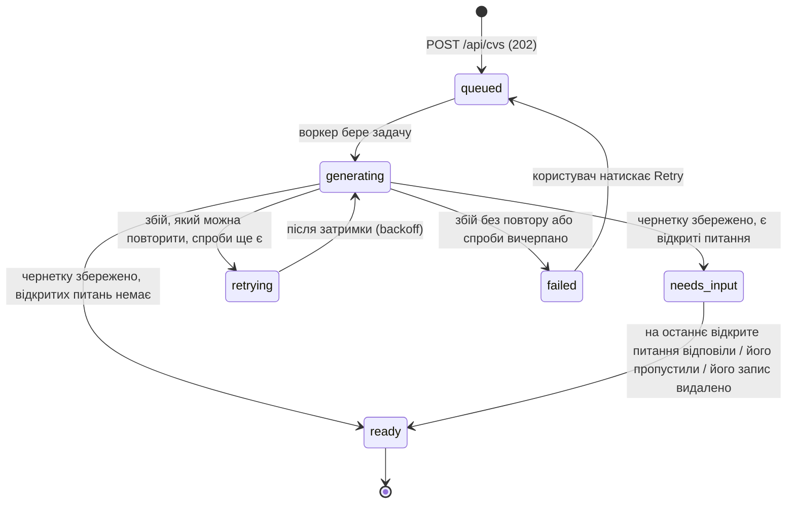

# Статуси CV

> Це переклад `docs/cv-statuses.md`; джерелом істини є англійська версія.
> Статус: **чернетка на розгляді** — частина набору проєктних документів
> [architecture.md](architecture.md) · [api.md](api.md) · cv-statuses.md (цей файл).

Єдиний перелік статусів для бекенду і фронтенду. Лише бекенд **обчислює** статус; фронтенд
тільки **зіставляє** рядок із підписом, кольором, набором дій і рішенням щодо опитування (polling).
Наведений нижче код розміщено в `shared/src/cv-status.ts`, і його імпортують обидва застосунки,
тож вони не можуть розійтися.

## 1. Шість статусів



| статус | значення | data | додаткові поля |
|---|---|---|---|
| `queued` | Вхідні дані збережено, задача чекає на воркер | `null` | `queuePosition` |
| `generating` | Працює DraftAgent | `null` | `stage`, `attempt` |
| `retrying` | Спроба завершилася помилкою, яку можна повторити; очікування затримки (backoff) | `null` | `attempt`, `maxAttempts` |
| `failed` | Помилка без повтору або всі спроби використано | `null` | `error` |
| `needs_input` | Чернетку збережено, принаймні одне питання має статус `open` | `CvData` | `openQuestions` |
| `ready` | Чернетку збережено, відкритих питань немає (на всі відповіли або їх пропустили) | `CvData` | — |

CV залишає бік «без чернетки» рівно один раз: після першої успішної спроби. Далі статус
змінюється лише як `needs_input → ready`, а `ready` — остаточний. Перенацілення CV на іншу роль
не є переходом — воно створює **нове** CV (див. [architecture.md §7](architecture.md#7-цільова-роль-і-match)).

### Групи — що фронтенд вирішує за статусом

| група | статуси | опитування | екран |
|---|---|---|---|
| **у процесі** | `queued`, `generating`, `retrying` | увімкнено, кожні 3 с | картка прогресу, без редактора |
| **потребує користувача** | `failed` | вимкнено | текст помилки + **Retry** |
| **має чернетку** | `needs_input`, `ready` | вимкнено | редактор, попередній перегляд, match, PDF (+ питання, коли `needs_input`) |

### Спільний код

```ts
// shared/src/cv-status.ts
export const CV_STATUSES = [
  'queued', 'generating', 'retrying', 'failed', 'needs_input', 'ready',
] as const;
export type CvStatus = (typeof CV_STATUSES)[number];

export const CV_TRANSITIONS: Record<CvStatus, readonly CvStatus[]> = {
  queued:      ['generating'],
  generating:  ['needs_input', 'ready', 'retrying', 'failed'],
  retrying:    ['generating'],
  failed:      ['queued'],
  needs_input: ['ready'],
  ready:       [],
};

export const canTransition = (from: CvStatus, to: CvStatus) => CV_TRANSITIONS[from].includes(to);
export const isInProgress = (s: CvStatus) => s === 'queued' || s === 'generating' || s === 'retrying';
export const hasDraft     = (s: CvStatus) => s === 'needs_input' || s === 'ready';

export const GENERATION_STAGES = ['drafting', 'verifying', 'revising', 'saving'] as const;
export type GenerationStage = (typeof GENERATION_STAGES)[number];
```

## 2. Для кожного статусу: бекенд, фронтенд, дії користувача

### `queued` — «У черзі»
- **Бекенд:** рядок `cvs` і рядок `generation_jobs` записуються в одній транзакції, після чого
  id задачі додається до BullMQ. `queuePosition` = кількість CV у статусі `queued`, створених
  раніше (усіх користувачів) + 1 — назовні сервера виходить лише це число.
- **Фронтенд:** нейтральний бейдж, «Перед вами N» (без обіцянок щодо часу). Опитує.
- **Користувач може:** видалити; закрити вкладку — нічого не втрачається.

### `generating` — «Генерується»
- **Бекенд:** воркер встановлює `generating` + `attempt`, запускає DraftAgent (див.
  [architecture.md §6](architecture.md#6-пайплайн-генерації)) і оновлює `stage`:

  | stage | що відбувається | текст в UI |
  |---|---|---|
  | `drafting` | модель пише чернетку | «Пишемо ваше CV» |
  | `verifying` | факти звіряються з джерелом | «Звіряємо факти з вашим джерелом» |
  | `revising` | модель виправляє факти, які відхилив верифікатор (крок 2–3 циклу агента) | «Виправляємо непідтверджені факти» |
  | `saving` | чернетка, питання та вимоги записуються в одній транзакції | «Зберігаємо» |

- **Фронтенд:** акцентний бейдж, спінер + текст етапу. Опитує. Редактора ще немає.
- **Користувач може:** видалити.

### `retrying` — «Повторна спроба»
- **Бекенд:** спроба завершилася помилкою, **яку можна повторити** (Anthropic 429/5xx/overloaded,
  мережа, тайм-аут, вихід, що не відповідає схемі, після останнього кроку агента). BullMQ
  перезапускає її після експоненційної затримки (5 с, 10 с). `attempt` збільшується, коли
  починається наступна спроба.
- **Фронтенд:** бейдж-попередження, «Спроба 2 з 3 не вдалася, повторюємо…». Опитує.
- **Користувач може:** видалити. Більше нічого не потрібно.

### `failed` — «Помилка»
- **Бекенд:** статус настає, коли спроби вичерпано, **або** помилка не підлягає повтору
  (недійсний API-ключ, запит відхилено як некоректний, вхідні дані завеликі для моделі).
  Зберігає `error_code` і зрозумілий людині `error`. Текст джерела та факти користувача
  залишаються, тож для Retry не потрібно завантажувати файл повторно.

  | error_code | повідомлення для користувача |
  |---|---|
  | `LLM_UNAVAILABLE` | «Сервіс ШІ зараз недоступний. Спробуйте ще раз за кілька хвилин.» |
  | `LLM_INVALID_OUTPUT` | «ШІ кілька разів повернув непридатну чернетку. Спробуйте ще раз.» |
  | `LLM_CONFIG` | «Сервіс ШІ не налаштовано на сервері.» (неправильний/відсутній ключ) |
  | `TIMEOUT` | «Генерація тривала надто довго. Спробуйте ще раз.» |
  | `INTERNAL` | «Щось пішло не так на нашому боці. Спробуйте ще раз.» (подробиці лише в логах) |

- **Фронтенд:** бейдж небезпеки, текст помилки, **Retry** і **Delete**. Опитування припиняється.
- **Користувач може:** повторити (`POST /api/cvs/:id/retry` → `queued`, `attempt` скидається
  до 1; зараховується до погодинного ліміту), видалити.

### `needs_input` — «Потрібні ваші відповіді»
- **Бекенд:** чернетку збережено, є відкриті питання. Кожна відповідь/пропуск оновлює своє поле
  (див. [architecture.md §6.5](architecture.md#65-питання-та-відповіді)); коли закривається
  останнє відкрите питання, та сама транзакція встановлює `ready`. Ручне збереження, яке видаляє
  запис, пропускає питання про нього — і цим теж може закрити останнє.
- **Фронтенд:** бейдж-попередження з кількістю відкритих питань; редактор, панель питань,
  панель match, попередній перегляд, Download PDF. Без опитування.
- **Користувач може:** відповісти, вибрати варіант, пропустити, відредагувати будь-яке поле,
  завантажити PDF, створити CV для запропонованої ролі, видалити.

### `ready` — «Готово»
- **Бекенд:** чернетку збережено, відкритих питань немає. PDF рендериться з поточних `data` під
  час кожного завантаження.
- **Фронтенд:** бейдж успіху; редактор, панель match, попередній перегляд, Download PDF. Панель
  питань лишається, поки в CV є питання: вона каже, що відкритих немає, і показує закриті з
  відповідями; у CV, який ніколи не мав питань, її немає.
- **Користувач може:** редагувати, завантажити PDF, створити CV для запропонованої ролі, видалити.

## 3. Дозволені дії за статусом

API забезпечує дотримання цієї таблиці; будь-що інше повертає `409 INVALID_STATE`. Видалення
дозволене завжди.

| endpoint | queued | generating | retrying | failed | needs_input | ready |
|---|:-:|:-:|:-:|:-:|:-:|:-:|
| `GET /api/cvs/:id` | ✓ | ✓ | ✓ | ✓ | ✓ | ✓ |
| `DELETE /api/cvs/:id` | ✓ | ✓ | ✓ | ✓ | ✓ | ✓ |
| `POST /api/cvs/:id/retry` | | | | ✓ | | |
| `PATCH /api/cvs/:id` | | | | | ✓ | ✓ |
| `GET /api/cvs/:id/pdf` | | | | | ✓ | ✓ |
| `POST …/questions/:qid/answer`, `/skip` | | | | | ✓ | |
| `POST /api/cvs` з `fromCvId` (нове CV, те саме джерело) | | | | | ✓ | ✓ |

## 4. Як змінюється статус

- **Один записувач.** Лише `CvStatusService` змінює `cvs.status`. Його викликають воркер,
  ендпоінт відповідей і ручне збереження; перед записом він перевіряє `canTransition`.
- **Compare-and-set.** Кожен перехід має вигляд
  `UPDATE cvs SET status = :to, … WHERE id = :id AND status = ANY(:allowedFrom)`.
  Оновлено 0 рядків ⇒ хтось інший змінив статус CV або видалив його ⇒ викликач відкидає свій
  результат. Завдяки цьому повторні запуски BullMQ (stalled jobs) і видалення під час генерації
  безпечні без блокувань.
- **Чернетка + статус в одній транзакції.** `data`, питання, вимоги, `version + 1` і статус
  записуються разом; збій посередині залишає CV у `generating`, і перевірка stalled jobs у
  BullMQ запускає задачу повторно.
- **Відновлення під час старту воркера.** CV у статусах `queued`/`generating`/`retrying` без
  живої задачі BullMQ (наприклад, Redis очистили) повторно ставляться в чергу; `jobId` = id рядка
  задачі, тож дублікати ігноруються.

## 5. Пов'язані скінченні автомати

### Питання (`cv_questions.status`)

```
open ──answer──▶ answered      (кінцевий; щоб змінити пізніше, відредагуйте поле вручну)
  └───skip────▶ skipped        (кінцевий; поле лишається порожнім, не рендериться)
```

### Спроба генерації (`generation_jobs.status`) — лише для аудиту

Один рядок на спробу: `running → succeeded | failed`. Зберігає модель, версію промпту, кроки
агента, токени, тривалість і внутрішню помилку. UI ніколи не читає його напряму; `attempt` та
`error` копіюються в `cvs`.

## 6. Не статуси

| що | де це зберігається натомість |
|---|---|
| ненадіслана форма створення | лише в браузері (стан форми, необов'язкова чернетка в `sessionStorage`) |
| підкроки генерації | поле `stage`, лише для тексту прогресу |
| ручні правки | нова `version` для `data`; статус не змінюється, окрім випадку, коли видалення елемента пропускає його відкриті запитання і з закриттям останнього `needs_input` → `ready` |
| оцінка match | обчислюється з `data` + вимог під час кожного рендеру/читання, ніколи не зберігається |
| PDF | рендериться на льоту, ніколи не зберігається |
| видалене CV | рядка більше немає (каскадне видалення питань/задач) |
